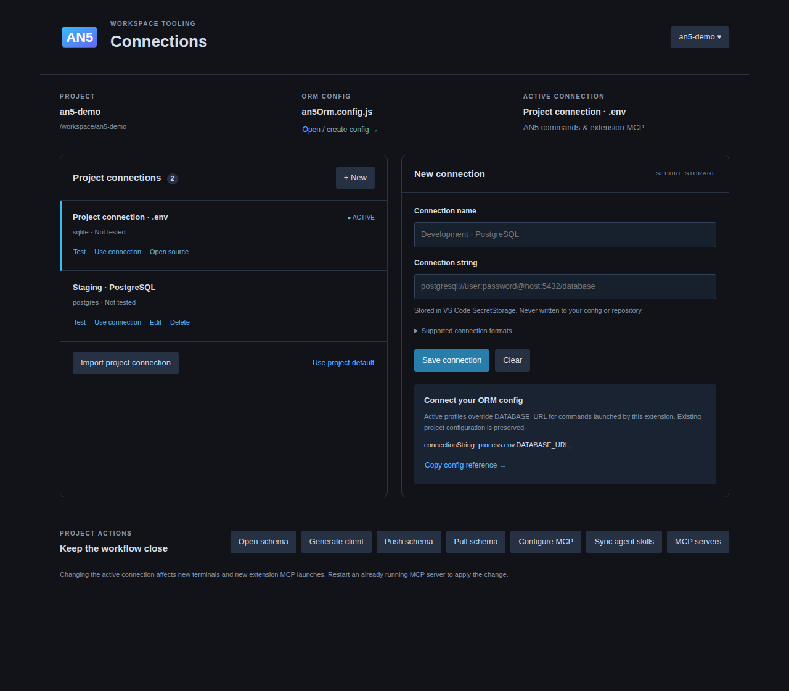

# an5OrmVScode

<p align="center">
  
</p>

<p align="center">
  <a href="https://marketplace.visualstudio.com/items?itemName=an5orm.an5-orm-vscode">
    
  </a>
  <a href="https://github.com/an5ORM/an5OrmVScode/releases/latest">
    
  </a>
  <a href="https://open-vsx.org/extension/an5orm/an5-orm-vscode">
    
  </a>
</p>

VS Code extension for AN5 ORM schema files. Provides syntax highlighting, formatting, status bar commands, and tooling for `an5Orm.config.js` and `.an5` files.

Published on the [VS Code Marketplace](https://marketplace.visualstudio.com/items?itemName=an5orm.an5-orm-vscode) and on [Open VSX](https://open-vsx.org/extension/an5orm/an5-orm-vscode).

## Features

- **AN5 Activity Bar** — Connections, Schema Explorer and Project Actions in one sidebar
- **Connection manager** — Add/edit/delete profiles, test connectivity and choose the active database
- **SecretStorage** — Connection strings stay out of workspace settings, config files and the repository
- **Schema Explorer** — Browse models, fields, primary keys and relations; open declarations directly
- **Syntax highlighting** — Color-coded model definitions, fields, attributes
- **Auto-formatting** — Align fields, types, and attributes
- **Snippets** — Quick code completion for common patterns
- **MCP server** — Exposes the AN5 ORM to agentic clients such as GitHub Copilot

## Connections and workspace UI (1.2.0)

Click the **AN5** logo in the Activity Bar, then **Workspace Tooling**.



Project connections appear automatically from `DATABASE_URL`, `.env` or
`an5Orm.config.js/.cjs`; no import is required. Configured subprojects are discovered
inside a workspace too. The manager follows the nearest project for the active editor,
and refreshes when configuration files change. Source connections are live references:
**Open source** edits the original file; they are not copied into saved profiles.

1. Choose the project in the top right when using multiple folders or subprojects.
2. Add a name and a SQL Server, PostgreSQL, MySQL or SQLite connection string; **Save connection** stores it in VS Code SecretStorage.
3. Select **Test** to run `SELECT 1`, then **Use connection** to activate the profile.
4. **Edit** keeps saved credentials when its password field is left blank. **Delete** removes the profile and its stored secret.

**Import project connection** is optional when you want a separate saved copy. It reads the current `DATABASE_URL`, project `.env`, or
`connectionString` in `an5Orm.config.js/.cjs`, in that order, and stores a secure copy.
It does not modify the source file. If secrets are already in a config file, importing
them does not remove them; edit that file to use an environment reference when needed.

Active profiles override `DATABASE_URL` for AN5 tasks and **extension-provided MCP
servers**. Restart an existing MCP server after changing profiles. A manually configured
`.vscode/mcp.json`, `.mcp.json`, or another client's server uses that client's environment
and the project config; it does not have access to the extension's SecretStorage.
**Use project default** clears the profile override. Secrets are not exported to MCP JSON.

Use **Open / create config** to edit the actual workspace config. **Copy config reference**
copies `connectionString: process.env.DATABASE_URL,` for use inside `module.exports`.
The extension never rewrites an existing JavaScript config automatically.

The **Schema Explorer** shows declarations without automatically connecting to a database.
**Project Actions** provides Generate, Push, Pull and MCP configuration shortcuts. Push and
Pull require confirmation. Workspace scripts run from the workspace root; generation can
also use the installed ORM's compiled generator. Database command entry points must be
available locally or provided by workspace npm scripts. No package is downloaded as a fallback.

Connection checks require `@an5/adapters` and the relevant database driver in the project.
Checks run in an isolated Node process with a 15-second limit; driver error messages and
credentials are not forwarded to the UI. SQLite relative paths resolve from the workspace.
Profiles belong to the current VS Code workspace; credentials may need to be entered again
when moving to a different machine or editor profile. Database operations require Workspace Trust.

## MCP server (GitHub Copilot, Cursor, Claude Desktop)

The extension ships a [Model Context Protocol](https://modelcontextprotocol.io)
server, so agentic clients can inspect your AN5 schema, run read-only queries
and drive schema operations instead of guessing at your data model.

On VS Code 1.101 or newer the server registers itself: open `MCP: List Servers`
and start **AN5 ORM**. Nothing to copy, and no config file to edit.

If it does not appear — an older build, or an editor such as Cursor or VSCodium
that predates the API — run **AN5: Install MCP Server** from the Command Palette
(or click the status bar item and pick it). It writes the entry into the open
workspace for you, with the extension path already resolved:

- `.mcp.json` — the portable format, read by VS Code and other agent tools
- `.vscode/mcp.json` — the VS Code format

Your other servers and the rest of the file are left alone, running it twice
changes nothing, and a file it cannot parse is reported rather than overwritten.

The extension resolves an absolute Node binary from `PATH`. Set `an5.nodePath` to
an absolute Node path if your editor cannot find your version-manager installation.
When no Node binary is available, the editor runtime is used in Node mode.

To see the resolved configuration without writing it, run
**AN5: Show MCP Server Configuration**.

For another MCP client, point it at the server inside the installed extension;
**AN5: Show MCP Server Configuration** prints the paths to use. There is no
`node_modules` copy to run — this extension is installed from the marketplace,
not from npm.

The server discovers the project from its working directory: it reads
`an5Orm.config.js`, finds the `.an5` files, uses the installed `@an5/orm` for
generate/push/pull/migrate/seed, and connects with `DATABASE_URL` from the
environment or the project `.env`.

### Tools

Read-only tools are marked `readOnlyHint`, so VS Code runs them without asking
for confirmation.

| Tool | What it does |
|------|--------------|
| `an5_list_models` | List every model, its table, and field/relation counts |
| `an5_describe_model` | Fields with SQL type, keys, defaults, and relations |
| `an5_get_relations` | Relation graph with foreign/local key columns |
| `an5_analyze_schema` | Missing keys, unindexed foreign keys, unique candidates |
| `an5_generate_code` | Request-specific schema/API context for the calling model to write application code |
| `an5_read_schema_file` | Raw contents of a `.an5` file (workspace-scoped) |
| `an5_query_database` | Run a `SELECT`; other statements are rejected |
| `an5_describe_table` | Table columns from the schema, else from the database |
| `an5_database_health` | Connectivity and latency check |

These tools change the database or write files. They are not marked read-only,
so VS Code shows a confirmation dialog, **and** they require an explicit
`confirm: true` argument so a model cannot trigger them on its own.

| Tool | What it does |
|------|--------------|
| `an5_generate_client` | Generate client code for TypeScript/Python/.NET/Go/Rust/Java/Kotlin/Swift |
| `an5_push_schema` | Create tables and missing columns from the schema |
| `an5_pull_schema` | Introspect the database into `.an5` files |
| `an5_migrate` | `diff`, `generate`, `apply`, `rollback`, `status` |
| `an5_seed` | Insert the ORM seed data |


## Installation

### From the Marketplace

Install **AN5 ORM Schema Tooling** from the Extensions view, or:

```bash
code --install-extension an5orm.an5-orm-vscode
```

The extension id is the same on both registries, so the same command works in
VSCodium and other VS Code-compatible editors — they resolve it against Open VSX
instead.

- [VS Code Marketplace](https://marketplace.visualstudio.com/items?itemName=an5orm.an5-orm-vscode)
- [Open VSX](https://open-vsx.org/extension/an5orm/an5-orm-vscode)

### From a VSIX

```bash
code --install-extension an5-orm-vscode-<version>.vsix
```

Build one with `npm run package`. Every GitHub Release attaches the tested VSIX,
which is also what the Marketplace upload uses.

### From Source

```bash
npm install
npm run compile
```

Then press `F5` in VS Code to launch the Extension Development Host.

## Usage

Open any `.an5` file to get syntax highlighting and formatting.

### Schema Syntax

```an5
model User {
  id        NVARCHAR(255) @id @default(uuid())
  email     NVARCHAR(255) @unique
  name      NVARCHAR(255)?
  createdAt DATETIME2     @default(now())
  orders    Order[]

  @@map("users")
}
```

### Formatting

Press `Shift+Alt+F` (Windows/Linux) or `Shift+Option+F` (Mac) to format the document.

**Before:**
```an5
model User {
id NVARCHAR(255) @id @default(uuid())
email NVARCHAR(255) @unique
name NVARCHAR(255)?
createdAt DATETIME2 @default(now())
}
```

**After:**
```an5
model User {
  id        NVARCHAR(255) @id @default(uuid())
  email     NVARCHAR(255) @unique
  name      NVARCHAR(255)?
  createdAt DATETIME2     @default(now())
}
```

### Snippets

Type the prefix and press `Tab` to expand:

| Prefix | Expansion |
|--------|-----------|
| `model` | Full model block |
| `@description` | `@description("...")` |
| `@@description` | `@@description("...")` |
| `@id` | `@id @default(uuid())` |
| `@unique` | `@unique` |
| `@default` | `@default(...)` |
| `@relation` | `@relation(fields: [], references: [])` |
| `@@map` | `@@map("tableName")` |
| `@@unique` | `@@unique([field1, field2])` |
| `@@index` | `@@index([field1, field2])` |

## Development

```bash
# Compile
npm run compile

# Watch mode
npm run watch

# Run tests
npm test

# Package VSIX bundle
npm run package

# Publish to VS Code Marketplace
npm run publish:marketplace -- -p <VSCE_PAT_TOKEN>

# Publish to Open VSX Registry
npm run publish:openvsx -- -p <OVSX_PAT_TOKEN>
```

## Testing

```bash
# Smoke test
node test/smoke.test.js

# Snippets test
node test/snippets.test.js

# Grammar test
node test/grammar.test.js
# MCP server, definition and config merge
node test/mcp.test.js
```

## License

MIT

## Automated releases

Pull requests and pushes to `main` run a clean install, build, tests and VSIX packaging.
To release, update `package.json` and `package-lock.json` to a new stable version,
add its entry to `CHANGELOG.md`, then push to `main`. CI creates `v<version>`
and a GitHub Release with the tested VSIX attached. An existing version on a
different commit is left alone. Version tags and manual workflow runs also work.

Open VSX publishing uses the same tested VSIX with OIDC Trusted Publishing.
The `openvsx` job has `id-token: write` and uses `--trusted-publishing`; it does
not use an `OVSX_PAT` secret.

Before running a release, an owner of namespace `an5orm` must register the
extension at [Settings → Trusted Publishers](https://open-vsx.org/user-settings/trusted-publishers):

- Provider: **GitHub Actions**
- Namespace: **an5orm**; extension: **an5-orm-vscode**
- Organization or User name: **an5ORM**
- Repository name: **an5OrmVScode**
- Workflow filename: **ci-release.yml**
- Environment name: leave empty (the publishing job does not use an environment)

The publisher agreement must already be signed and an active extension version
must exist. After a successful CI publication, remove the unused `OVSX_PAT`
repository secret and revoke its old token if it is not used elsewhere.
See the [Open VSX Trusted Publishing documentation](https://github.com/eclipse-openvsx/openvsx/wiki/Trusted-Publishing).

### VS Code Marketplace (manual upload, no Azure billing)

Marketplace publishing uses your browser login, without `VSCE_PAT` or an Azure
subscription. To prepare a tested local package and open the upload page, run:

```bash
npm run upload:marketplace
# Package and print instructions without opening a browser:
npm run upload:marketplace -- --no-open
```

The tool runs the full extension tests and invokes the installed vsce CLI through
Node, including on volumes where executable shims cannot run. It prints the exact
VSIX path and publisher URL. Choose a new version in `package.json` and synchronize
the lockfile before preparing an update. The final upload uses your browser login.
Manual upload is also described in the [VS Code publishing guide](https://code.visualstudio.com/api/working-with-extensions/publishing-extension).

Alternatively, after GitHub creates the release:

1. Download `an5-orm-vscode-<version>.vsix` from the
   [GitHub Release](https://github.com/an5ORM/an5OrmVScode/releases).
2. Open [publisher an5orm](https://marketplace.visualstudio.com/manage/publishers/an5orm).
3. Select **More Actions → Update** for AN5 ORM Schema Tooling.
4. Choose the downloaded VSIX and click **Upload**.
5. Wait for verification and confirm the new version on the
   [public Marketplace page](https://marketplace.visualstudio.com/items?itemName=an5orm.an5-orm-vscode).

The workflow summary includes direct release and VSIX download links. CI does not
publish to the VS Code Marketplace automatically. A missing `VSCE_PAT` never
fails this workflow. Do not commit tokens or pass them in command-line arguments.

### Agent skills in your project

Run **AN5: Sync Agent Skills** from the Command Palette, the AN5 actions sidebar or Connections. It uses the selected project (including nested AN5 projects) and writes `.agents/skills/an5-orm/SKILL.md` plus an AN5 section in `AGENTS.md`. The skill covers schemas, generated clients, provider adapters, connection scope, npm scripts and MCP tools. Agents that read `AGENTS.md` can follow its link even without automatic skill discovery.

Sync preserves instructions outside the managed AN5 markers and refuses to overwrite an existing unmanaged skill. Run it again after upgrading the extension or changing project scripts. It does not evaluate ORM configuration, include credentials, install global skills or change database/MCP settings. Workspace Trust is required. Skill discovery varies by agent; restart its session if it has already loaded project instructions.

## Application code over MCP

`an5_generate_code` accepts a user `request` and optional `language` (`auto`, `typescript`, `python`, `dotnet`, `golang`, `rust`, `java`, `kotlin`, `swift`). It discovers the selected workspace language and returns parsed schema plus actual generated API references. The calling AI model writes the requested application snippet from that context. The tool itself does not invoke an LLM or write application files. For multilingual workspaces, specify the language. Requires an installed `@an5/orm` exporting `prepareCodeRequest`; older installations return an upgrade error.

## Project setup and Google Sheets sign-in

Open **AN5: Manage Connections**. Expand **Project configuration** to edit the schema folder and generated client/metadata paths. Paths are relative to the selected project. Saving maintains a marked settings block in `an5Orm.config.js` or `.cjs`, preserving other configuration; it does not generate clients or change a database.

The connection builder includes local database and SQLite presets, masked URI previews, connection testing and storage choices. Connection string mode preserves advanced options that the visual builder cannot represent. Editing a saved profile leaves its credentials private unless you enter replacement details.

For Google Sheets, choose **Sheets** and expand **Google OAuth application setup**:

1. In Google Cloud, create an OAuth client with application type **Desktop app**, configure the consent screen and enable Google Sheets API and Google Drive API. Add your account as a test user while the application is in testing.
2. Import the downloaded client JSON, or enter its Client ID and optional Client secret. These settings are stored in SecretStorage for the selected project.
3. Click **Sign in with Google**, approve access in your system browser, then choose a spreadsheet. The connection is saved securely and activated; there is no manual spreadsheet ID or authorization-code entry.

The application requests spreadsheet read/write access and Drive metadata access to list spreadsheet names. Sign-in uses PKCE, state validation and a local loopback callback. The adapter refreshes expired access tokens using offline credentials. Install the adapter build containing offline OAuth support in the project; older versions can use an access token only until it expires.

Desktop OAuth currently requires a **local VS Code extension host**. Remote/Codespace extension hosts use service account authentication until a hosted redirect flow is available. No Google OAuth client is bundled: real sign-in requires your application's configuration. See the [Google desktop OAuth guide](https://developers.google.com/identity/protocols/oauth2/native-app).
